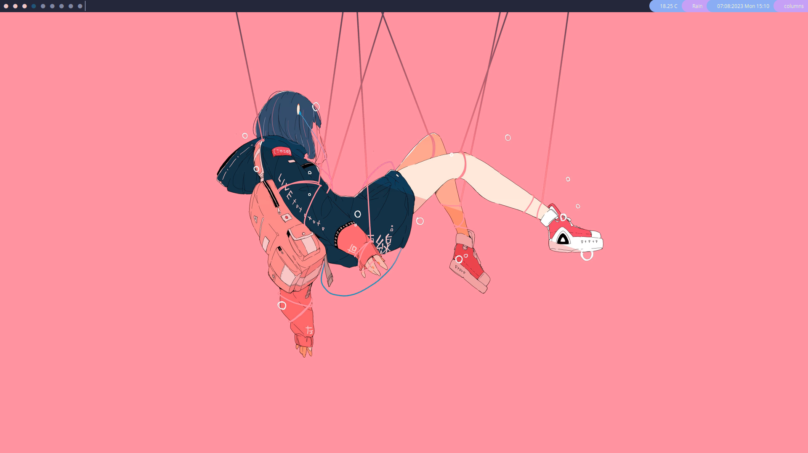
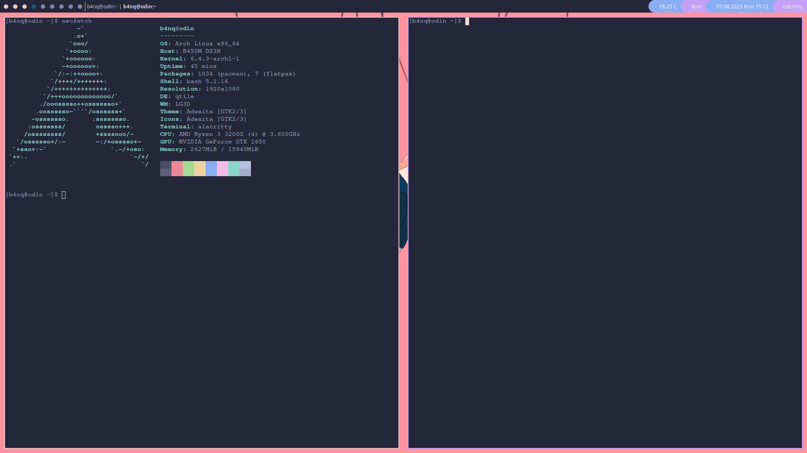

# odin - my system's configuration for Arch Linux
I want to build a highly personalized environment for myself, and odin is constantly improving part of it. I share this repository to inspire other people into creating their own systems. 




## description 
Odin is a collection of config files that make my experience on Arch Linux better and interface prettier. I will develop this project based on my personal preferences.  

## dependencies
- qtile
- qtile-extras-git 
- alacritty 
- rofi
- picom
- ttf-font-awesome
- ttf-opensans
- vscode-codicons-git 
- ttf-jetbrains-mono-nerd

### to install all of these dependencies use command below
```bash
yay -S qtile qtile-extras-git alacritty rofi picom ttf-font-awesome ttf-opensans vscode-codicons-git ttf-jetbrains-mono-nerd
```
## installation
Clone this repository
```bash
git clone https://github.com/bankubanku/odin.git 
```
change to the cloned repository
```bash
cd system-config
```
Copy files to the right directories
```bash
rsync -av --progress config/* ~/.config/. && rsync -a local/share/* ~/.local/share/. 
```
